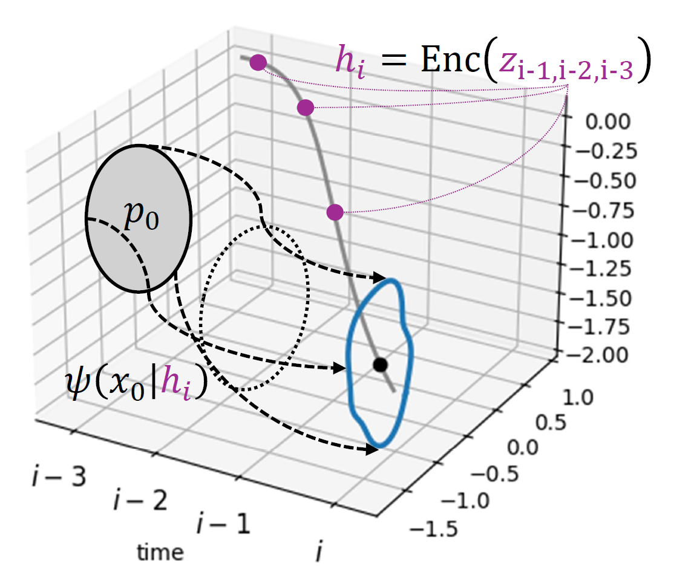

## Flow-based Conformal Prediction for Multi-dimensional Time Series

This repository contains soruce code of the method in the paper **["Flow-based Conformal Prediction for Multi-dimensional Time Series"](https://arxiv.org/pdf/2502.05709)**.


<p align="center">
  
</p>


### Implementation Example

The code was written in Python 3.9.13 with torch 2.2.2+cu118. Additional dependencies are listed in ```requirements.txt```.

We also provide Colab notebooks that walk through how to obtain the base predictor results and run experiments with FCP.

You can adapt these implementation examples to suit your own experiments.


#### Obtaining results of base predictor

In this colab notebook, we train base predictors and obtain results on wind data. GPU is not strictly required.

<a target="_blank" href="https://colab.research.google.com/github/Jayaos/flow_test/blob/master/base_predictor_example.ipynb">
  
</a>


#### Implementing FCP

In this colab notebook, we can reproduce experiments using FCP on wind 2d data. GPU accelerator for colab is recommended.

<a target="_blank" href="https://colab.research.google.com/github/Jayaos/flow_test/blob/master/fcp_implementation_example.ipynb">
  
</a>


### Citation

```bibtex
@article{lee2026flow,
  title={Flow-based Conformal Prediction for Multi-dimensional Time Series},
  author={Lee, Junghwan and Xu, Chen and Xie, Yao},
  booktitle={The Fourteenth International Conference on Learning Representations},
  year={2026}
}

